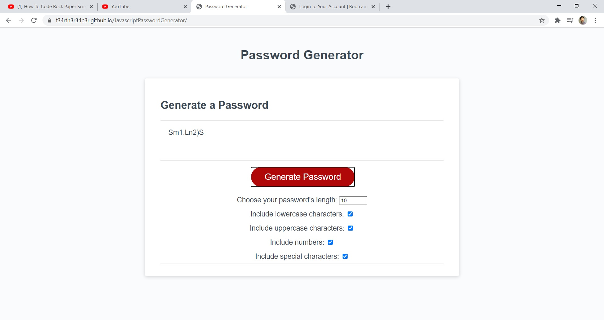

# Javascript Password Generator - Bootcamp Spot Project #3

## Overview

This document describes the components of a password generator powered by Javascript, HTML, and CSS.

This website is meant to demonstrate knowledge and competency in the following:

- DOM elements,
- Javascript arrays, conditionals, styling, and use of innerText

# Features
The following are the specific components and changes made to the original files

## HTML

- Added an number-type `<input>` which allows its value to be set between 8 and 128 characters. It soft blocks using the up/down arrows. However, you can manually enter any integer; Javascript code address this exploit. 
- Made the card-footer `
` house four checkboxes, associated to the four types of characters to be included in the random password generator.
- Made the above div and input `display: none` in CSS to make it invisible.
- Added a "let's get started" button, which, when clicked, makes these divs visible. Also makes this "let's get started" button invisible.

## CSS
- Made the card-footer div's `display: none`, visible only when the get-started button is clicked.

## Javascript

- **Lines 3 to 25**: These four features serve to generate a random: 
    - special case character;
    - number;
    - upper case character;
    - lower case character;
- **Lines 29 to 38**: These are Javascript variables to connect to HTML IDs.
- **Lines 40 to 44**: The click event which makes HTML elements invisible/visible when the "Let's Get Started" button is clicked.
- **Lines 50 to 148**: The "password generate" function, which works as follows:
    - **Lines 55 to 60**: Determines if the checkboxes have been checked; returns `true` if checked.
    - **Lines 62 to 72**: If a character box is checked/true, its respective function (i.e., lines 3-25) is placed into an empty array. All checked boxes have their respective function placed in the array. No checked boxes, nothing in the array.
    - **Lines 75 to 94**: Hard blocks preventing a password output if the number input is < 8 or > 128 characters.
    - **Lines 100 to 119**: If the password length is appropriate, a function runs through the 'functions array' repeatedly, creating a lengthy string of appropriate characters. It is then sliced down to 8 characters; this guarantees that every character types is presented at least once.
    - **Lines 121 to 130**: Any additional output past the 8th character is produced by randomly indexing the 'functions array', spitting out characters based on the character types permitted.
    - **Lines 132 to 141**: Console.log outputs. These allow for a user to understand what is happening behind the scenes. It presents:
        - The requested password length (in characters),
        - The string and its length,
        - The length of the text output.
        - Note: if done normally, these three numbers should be identical; however, breaking the rules of the generator will create disparate outcomes.

## Challenges
- It was conceptually difficult to think of a different way to guarantee character types. You could arrange for the array to loop repeatedly, but then the string output would be predictable, considering that the character types would repeat themselves, such as `123412341234` or `134134`. I made the first 8 characters predictable, then made all additional characters random.
- The wording of the homework suggests that the application "prompts" you to do XYZ. This suggests that you should use `window.prompt()`. 
However, I got ahead of myself and learned how the DOM works. Creating a drop-down list after clicking the button seemed not only like a healthy compromise, but a more sustainable and repeatable piece of code.

# File Architecture

File name | Function
------------ | -------------
index.html | HTML
assets/style/style.css | CSS stylesheet
script2.js| Javascript
<pre>

</pre>
# Website Appearance 
Once loaded, the website should look like this:  

This website is available at the following URL:   https://f34rth3r34p3r.github.io/JavascriptPasswordGenerator/

# Contributor(s)
Daniel Pisani (F34rTh3R34p3r)

# MIT License

Copyright (c) 2021 Daniel Pisani (F34rTh3R34p3r) 

Permission is hereby granted, free of charge, to any person obtaining a copy of this software and associated documentation files (the "Software"), to deal in the Software without restriction, including without limitation the rights to use, copy, modify, merge, publish, distribute, sublicense, and/or sell copies of the Software, and to permit persons to whom the Software is furnished to do so, subject to the following conditions:

The above copyright notice and this permission notice shall be included in all copies or substantial portions of the Software.

THE SOFTWARE IS PROVIDED "AS IS", WITHOUT WARRANTY OF ANY KIND, EXPRESS OR IMPLIED, INCLUDING BUT NOT LIMITED TO THE WARRANTIES OF MERCHANTABILITY, FITNESS FOR A PARTICULAR PURPOSE AND NONINFRINGEMENT. IN NO EVENT SHALL THE AUTHORS OR COPYRIGHT HOLDERS BE LIABLE FOR ANY CLAIM, DAMAGES OR OTHER LIABILITY, WHETHER IN AN ACTION OF CONTRACT, TORT OR OTHERWISE, ARISING FROM, OUT OF OR IN CONNECTION WITH THE SOFTWARE OR THE USE OR OTHER DEALINGS IN THE SOFTWARE.